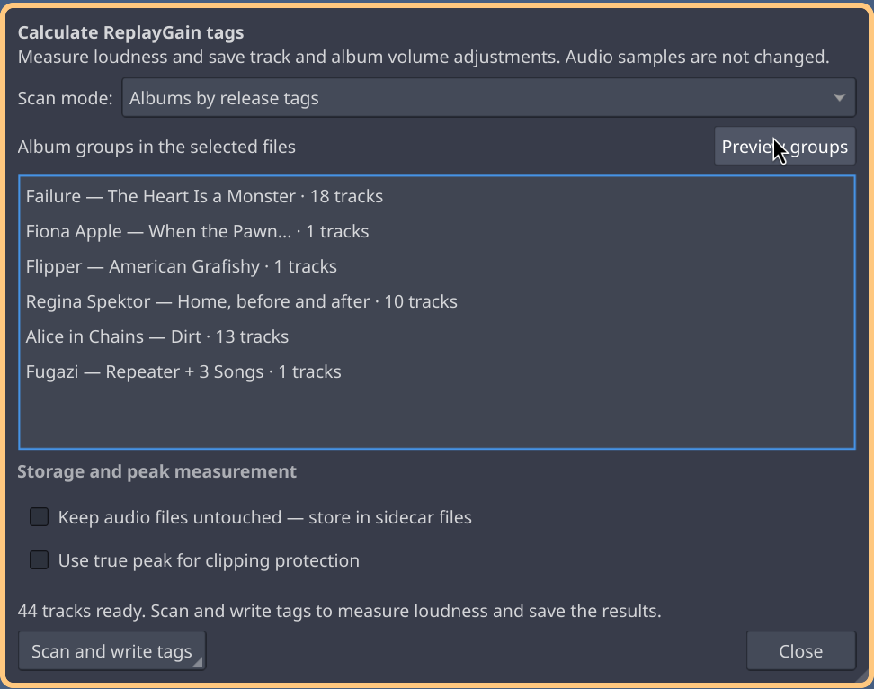
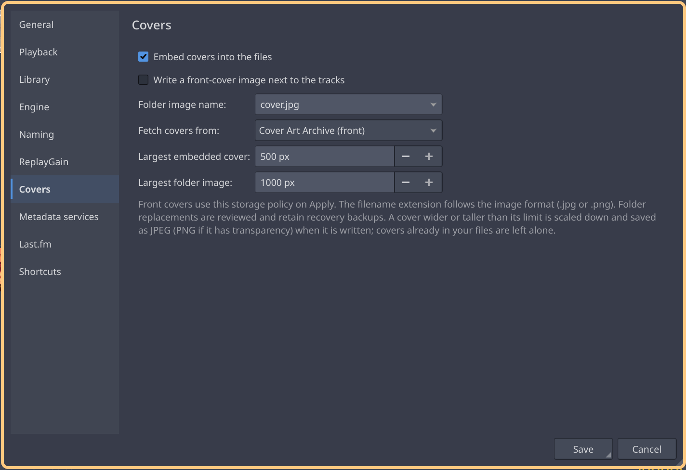

# Trackknife

A music player and tag editor for Linux, written in Qt 6. Think foobar2000
and Cantata: playlists grouped by album, lots of keyboard control, and tools
for keeping a collection in order.

Playback is done by Melody, a separate engine. Trackknife starts one for the
music on your computer; you can also run one on a server. Close the window and
the music keeps playing.


## Playing music

Playback is gapless. Local folders and your library open in tabs, and so does
a server's library. Whichever tab you play from decides which engine plays it.
Lists are kept across restarts.

The tab that's playing is marked **Active**. **Ctrl+J** jumps back to the
playing track. **Cursor follows playback** (Ctrl+Shift+J) moves the cursor
along with the music, but won't pull you out of a tab you're looking at.

The library shows artists, albums and tracks with covers. Searches go to the
library database, so they're fast; press **Refresh** after you've changed
files outside Trackknife.

To split a selection into a new tab, use **Copy to list → New tab…** or
**Move to list → New tab…**, or drop tracks on the empty space in the tab bar
(hold Ctrl to copy instead of move). Files on disk are never touched by this.

## Up Next and dynamic playlists

**Ctrl+Return** plays a track next, **Ctrl+Shift+Return** puts it at the end
of Up Next. After those, the playlist carries on where it was. **Ctrl+Shift+U**
opens the Up Next panel. It lives in the engine, so it works with Trackknife
closed too. More in the [Up Next guide](docs/up-next.md).

**File → Dynamic playlists…** builds a list from rules (tags, ratings and so
on) or from Last.fm: similar, loved, top or tagged tracks, matched against
what's in your library. Refreshing tries to pick different tracks than last
time. See [dynamic playlists](docs/dynamic-playlists.md).

For scrobbling, connect Last.fm under **Settings → Last.fm** and hand the
account to each engine. The engine scrobbles, so it works without Trackknife
running. [Last.fm setup](docs/lastfm.md) covers the API key.

## Tags and files

**Alt+Return** opens the tag editor for one file or a whole selection. Nothing
is written until you apply. MusicBrainz lookup works on untagged albums as
well: pick a release and line your files up against its track list.

Covers can be removed, fetched or added by hand, embedded or as a folder image
(**Settings → Covers**). **Tools → ReplayGain…** scans, **Tools → Convert
files…** converts (FLAC, MP3, Vorbis, Opus, whatever your FFmpeg has encoders
for). Renaming and moving show you the new paths before anything happens.

Tag editing: FLAC, WavPack, MP3, Vorbis, Opus, MP4/M4A. Embedded covers:
FLAC, MP3, MP4/M4A. Playback handles more; the
[format table](docs/feature-matrix.md#format-support-dimensions) has details.

## Search

**Ctrl+Shift+F**. Search the library or the current tab. Type a name, or
switch on **Query** for things like:

```text
bitspersample EQUAL 24
REPLAYGAIN_ALBUM_GAIN MISSING
artist HAS "Nina Simone" AND date GREATER 1960
```

**Save as…** keeps a search for later. A result tab is a snapshot, it doesn't
update. See the [library guide](docs/local-library.md#using-the-library) and
the [query reference](docs/query-language.md).

## Servers, speakers, phone

Run `melodyd` on the box with the music; clients find it on the network by
themselves. Any machine running an engine can be used as a speaker by the
others, and you can move playback between them mid-track.

The Android app (`android/`) is a remote for the engine, and can also play
on the phone itself: Opus over mobile data, and albums downloaded for offline
use. `melody-cli` is the same thing for the shell. Setup is in
[docs/melody.md](docs/melody.md).

<p>
  
  
  
  
  
</p>

## Shortcuts

All of these can be changed under **Settings → Shortcuts**. They only work
inside Trackknife, not desktop-wide.

| Action | Default shortcut |
| --- | --- |
| Play / Pause | Space |
| Stop | Ctrl+. |
| Previous / Next track | Alt+Left / Alt+Right |
| Queue next / Queue at end | Ctrl+Return / Ctrl+Shift+Return |
| Show Up Next | Ctrl+Shift+U |
| Jump to playing | Ctrl+J |
| Cursor follows playback | Ctrl+Shift+J |
| Find in list / Search | Ctrl+F / Ctrl+Shift+F |
| Open files / Open folder | Ctrl+O / Ctrl+Shift+O |
| New / Duplicate / Close tab | Ctrl+N / Ctrl+Shift+D / Ctrl+W |
| Edit tags / Settings | Alt+Return / Ctrl+, |

## Installing

Arch: `trackknife-git` and `melody-git` are in the AUR, or build from
`packaging/arch` with `makepkg -si`.

Releases ([v0.1.0](https://github.com/carnager/melody-next/releases/tag/v0.1.0))
have the engine, agent and CLI built for Debian 13 (amd64 and arm64), the
Android APK, and a Docker image for servers, see
[docs/melody.md](docs/melody.md#a-server).

### Building from source

C++23 compiler, CMake ≥ 3.28, Ninja, pkg-config, and:

- Qt ≥ 6.4 (Widgets, Concurrent, DBus, Network, Test)
- FFmpeg ≥ 6 with swscale, TagLib ≥ 2.0, libopenmpt ≥ 0.7
- PipeWire ≥ 0.3.50, libebur128 ≥ 1.2, SQLite ≥ 3.37, libutf8proc ≥ 2.9
- libcurl, OpenSSL (libcrypto), nlohmann-json
- optional: Chromaprint's `fpcalc`, for AcoustID

```sh
cmake --preset release
cmake --build --preset release
./build/release/src/bench/trackknife
```

This is new software and still moving. The [roadmap](docs/roadmap.md) lists
what isn't done.

## Docs and bugs

For a bug report, run `trackknife --debug` in a terminal and include the output.

- [Melody](docs/melody.md): engine, servers, speakers, phone, `melody-cli`
- [Local library](docs/local-library.md)
- [Formatting and scripts](docs/tkfmt.md): Trackknife's own `tkfmt-1`
  language, not compatible with foobar2000 or Picard scripts
- [Everything else](docs/README.md)

## More screenshots

<p>
  <a href="Screenshots/search.png"></a>
  <a href="Screenshots/tagger.png"></a>
  <a href="Screenshots/musicbrainz.png"></a>
  <a href="Screenshots/replaygain.png"></a>
  <a href="Screenshots/converter.png"></a>
  <a href="Screenshots/renaming.png"></a>
  <a href="Screenshots/settings.png"></a>
</p>

## License

GPL-3.0-only. See [LICENSE](LICENSE).
