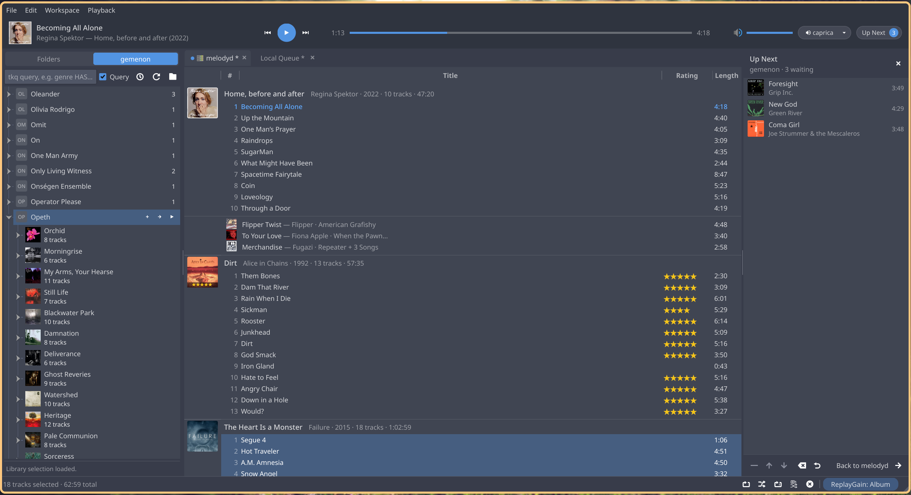
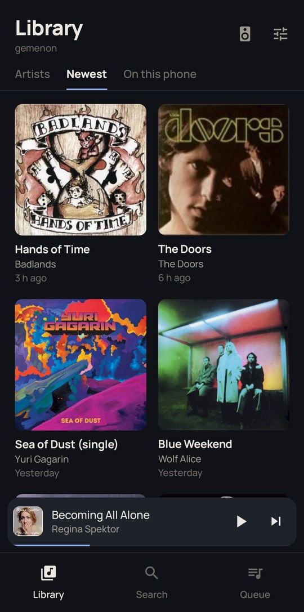
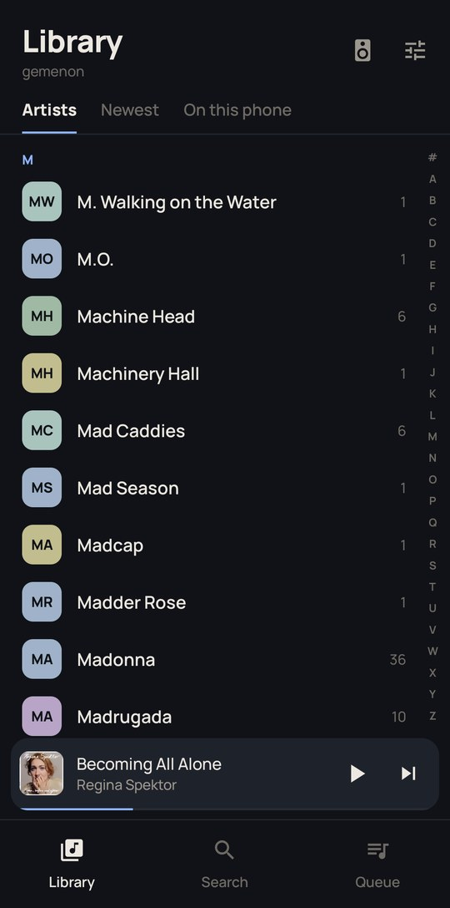
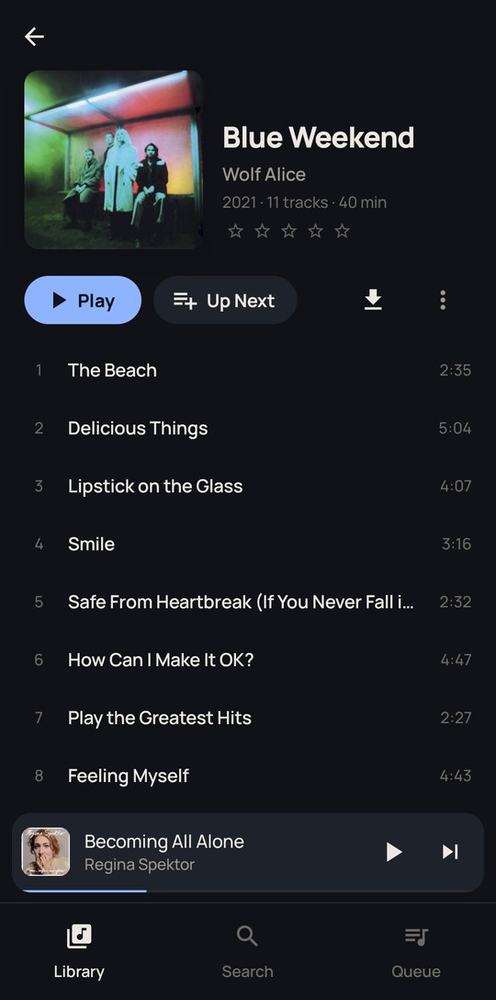
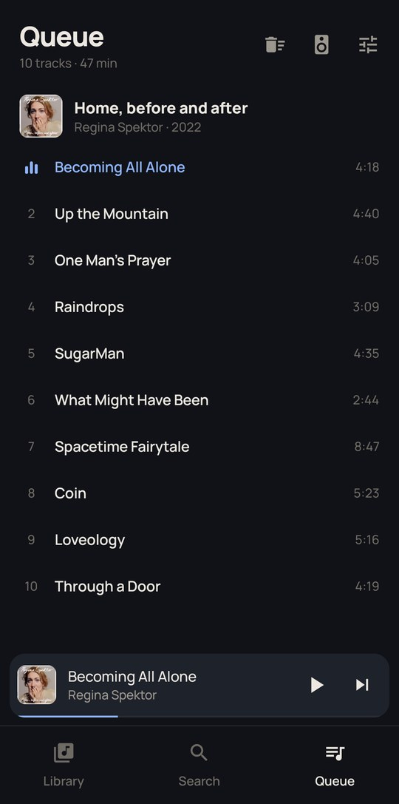
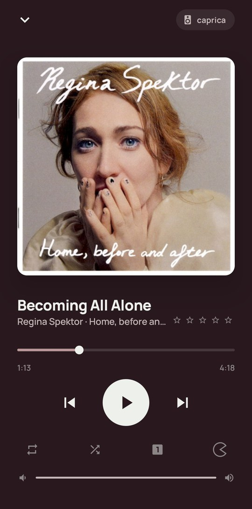
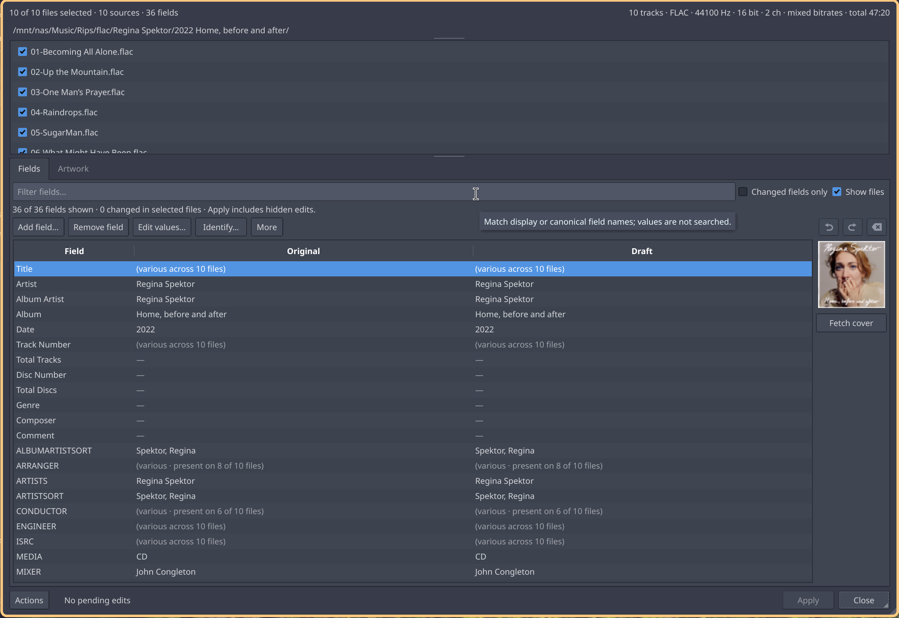
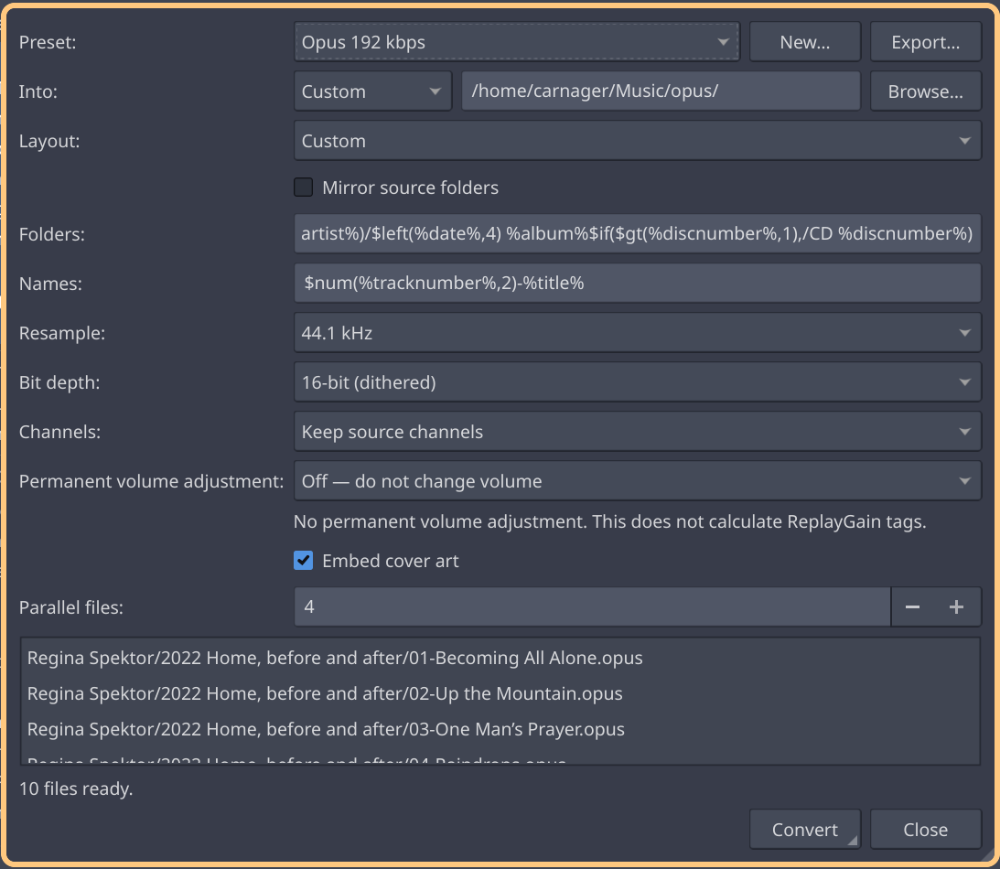

# Trackknife

Trackknife is a Linux music player and tag editor built with Qt 6. Playback
belongs to Melody, an engine that runs beside the app or on a server and keeps
playing when the window is closed. You can browse folders directly or add them
to a searchable library, and play on this computer, another one, or your phone.

It takes ideas from foobar2000 and Cantata: album-grouped playlists, keyboard
controls, and tools for looking after a music collection. The name comes from
foobar2000's reputation as a Swiss Army knife for audio files.



## Listening and browsing

Playback is gapless. Trackknife starts its own engine for the music on this
computer, and a server's library opens in tabs of its own. The tab you play
from decides which engine plays it. Lists survive a restart.

The list driving playback carries an **Active** label and accent text color.
It stays active through Stop and Pause, even while you browse another tab.
**Workspace → Jump to playing** (**Ctrl+J**) returns to the playing track.
The optional **Cursor follows playback** toggle follows new tracks when their
list is visible, without switching away from a tab you're browsing.

Both libraries browse artists, albums, and tracks, with covers and album counts.
Search results can be opened as a tab. For local files, searches use the library
database; opening results doesn't reread all your music. Press **Refresh** when
you want to scan for changes made outside the app.

Use **Copy to list → New tab…** or **Move to list → New tab…** to split out a
selection. You can also drop tracks from a local list onto empty tab-bar space
to create a tab. Dragging moves the entries; hold **Ctrl** to copy them. The
files stay where they are.

## Up Next and dynamic playlists

**Queue next** (**Ctrl+Return**) and **Queue at end** (**Ctrl+Shift+Return**)
add temporary requests. When they finish, normal playlist playback resumes.
Open the **Up Next** panel with **Ctrl+Shift+U** to reorder, remove, or clear
requests. The engine keeps handling them after Trackknife closes. See the
[Up Next guide](docs/up-next.md).

**File → Dynamic playlists…** uses the same editor for local and server
libraries. Build rules from tags, ratings, and other supported fields, or use
Last.fm similar, loved, top, or tagged tracks. Recommendations are matched to
music in your library; repeated refreshes prefer tracks outside the previous
selection when enough matches are available. Open results as a normal tab with
one line per track. See the [dynamic playlist guide](docs/dynamic-playlists.md)
for matching limits and server requirements.

Connect a Last.fm account under **Settings → Last.fm** and give it to each
engine: an engine scrobbles what it plays, with Trackknife open or not. A
track's Last.fm submenu has **Love track / Unlove track**.
[Account setup and scrobbling](docs/lastfm.md) explains the API credentials and
browser authorization.

## Tagging and file tools

**Tools → Edit tags…** in the track menu opens a tab where you can edit one file
or a whole selection. Use the checked file list in the sidebar to choose which
files you are editing.
Changes stay in a draft until you apply them. MusicBrainz lookup works with
untagged albums too: search for a release, then arrange your files beside its
track list to check the assignments.

You can remove covers, fetch replacements, or add your own images. Review a
fetched cover before applying it; **Settings → Covers** chooses embedded artwork,
a folder image, or both. Tags and embedded artwork share the save workflow.
**Tools → ReplayGain…** scans the selection, and **Tools → Convert files…** can
copy a cover, resample audio, and name its output from tags. Rename and move operations show the proposed paths
before changing files.

Text editing supports FLAC, WavPack, MP3, Vorbis, Opus, and MP4/M4A. Embedded
artwork editing supports FLAC, MP3, and MP4/M4A. Conversion presets cover FLAC,
MP3, Vorbis, and Opus, depending on the installed FFmpeg encoders. Playback
supports more formats than editing; see the [format table](docs/feature-matrix.md#format-support-dimensions)
for the limits.

## Searching your collection

Open **Workspace → Search…** (**Ctrl+Shift+F**) and choose **Library database**
to search the collection, or **Current tab** to search a local list. For a word search,
type an artist, album, or title. Enable **Query** for expressions such as:

```text
bitspersample EQUAL 24
REPLAYGAIN_ALBUM_GAIN MISSING
artist HAS "Nina Simone" AND date GREATER 1960
```

**Save as…** keeps a search so you can run it again. Result tabs contain the
matches from that run; they don't update automatically.

See the [library guide](docs/local-library.md#using-the-library) and
[query reference](docs/query-language.md) for more examples and details.

## Servers, speakers and the phone

Run `melodyd` on the machine with the music and every client finds it by name.
Any machine with an engine can lend its speakers to the others, a phone can be
a speaker too, and the music moves between them without stopping. The Android
app in `android/` browses and controls the library, plays on the phone with
Opus on mobile data, and keeps albums for listening offline. `melody-cli`
does the same from a shell. [Melody](docs/melody.md) explains the setup.

<p>
  
  
  
  
  
</p>

## Settings and keyboard controls

Settings brings together connection profiles, local library folders, playback,
naming layouts, ReplayGain, covers, metadata services, Last.fm, and shortcuts.
**Settings → Shortcuts** lets you change or clear bindings, checks for conflicts,
and offers Restore defaults. Changes apply on Save; Cancel leaves bindings alone.

| Action | Default shortcut |
| --- | --- |
| Play / Pause | Space |
| Stop | Ctrl+. |
| Previous / Next track | Alt+Left / Alt+Right |
| Queue next / Queue at end | Ctrl+Return / Ctrl+Shift+Return |
| Show Up Next | Ctrl+Shift+U |
| Jump to playing | Ctrl+J |
| Cursor follows playback | Ctrl+Shift+J |
| Find in list / Search | Ctrl+F / Ctrl+Shift+F |
| Open files / Open folder | Ctrl+O / Ctrl+Shift+O |
| New / Duplicate / Close tab | Ctrl+N / Ctrl+Shift+D / Ctrl+W |
| Edit tags / Settings | Alt+Return / Ctrl+, |

These shortcuts work within Trackknife, not globally across the desktop.

## Building

You need a C++23 compiler, CMake ≥ 3.28, Ninja, and pkg-config, plus these
libraries and their development headers:

- Qt ≥ 6.4, including Widgets, Concurrent, DBus, Network, and Test
- FFmpeg ≥ 6 (including swscale), TagLib ≥ 2.0, and libopenmpt ≥ 0.7
- PipeWire ≥ 0.3.50, libebur128 ≥ 1.2, SQLite ≥ 3.37, and libutf8proc ≥ 2.9
- libcurl, OpenSSL (libcrypto), and nlohmann-json

Chromaprint's `fpcalc` is optional, for AcoustID fingerprinting.

```sh
cmake --preset release
cmake --build --preset release
./build/release/src/bench/trackknife
```

On Arch Linux, the package recipe builds Trackknife, `melodyd`,
`melody-agent` and `melody-cli` as separate packages from the default branch:

```sh
cd packaging/arch
makepkg -si
```

For a server there is also a Docker image; see [Melody](docs/melody.md#a-server).

There are no versioned releases yet. The [roadmap](docs/roadmap.md) lists the
unfinished work.

## Help and development

Run `trackknife --debug` from a terminal to collect diagnostic traces for a bug
report. Debug tracing is off by default; warnings and errors remain visible.


- [Melody](docs/melody.md): the engine, servers, speakers, the phone and `melody-cli`.
- [Local library](docs/local-library.md): adding folders, searching, and refreshing.
- [Formatting and scripts](docs/tkfmt.md): tag transformations and naming patterns.
  The app uses its own language, `tkfmt-1`; foobar2000 and Picard scripts aren't
  interchangeable with it.
- [Documentation index](docs/README.md): guides, specifications, and build checks.

## More screenshots








## License

GPL-3.0-only. See [LICENSE](LICENSE).
